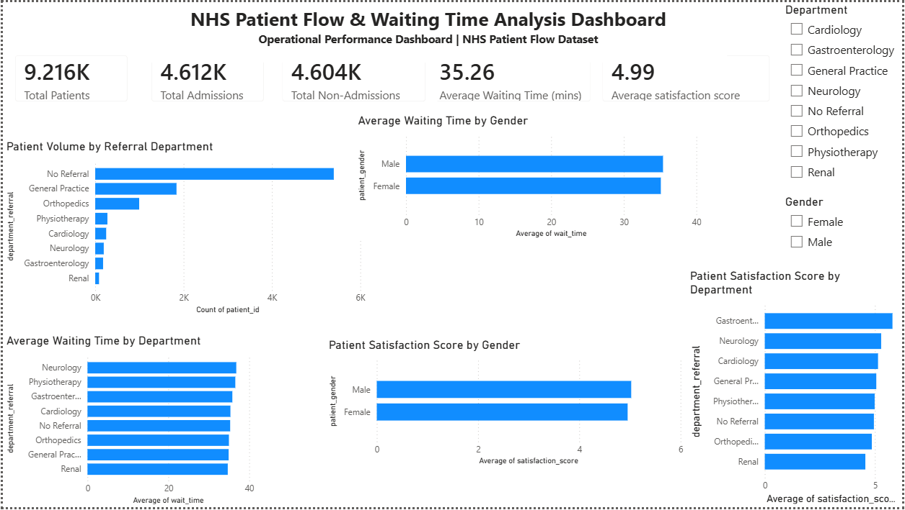
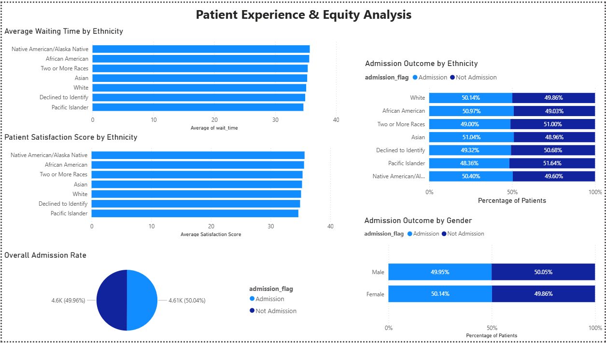
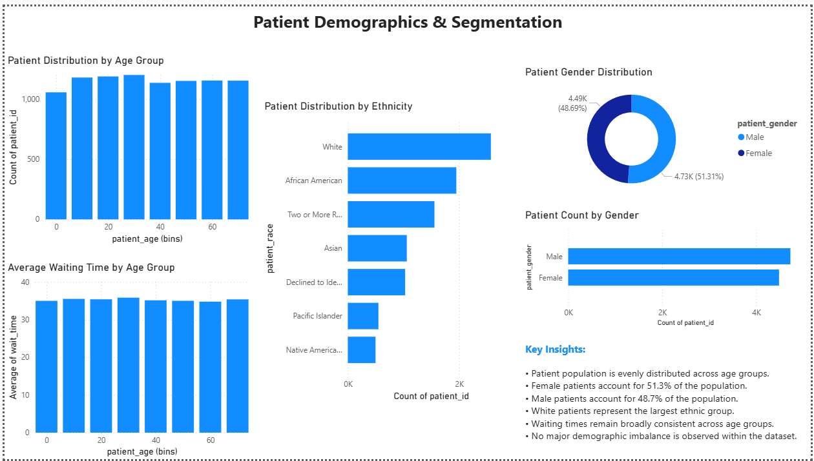

# NHS Patient Flow & Waiting Time Analytics

## Project Overview

This project analyzes NHS patient flow data using PostgreSQL and Power BI to evaluate patient admissions, waiting times, satisfaction scores, demographic patterns, and healthcare equity indicators.

The objective was to identify operational bottlenecks, understand patient experience, and generate actionable insights through interactive dashboards.

---

## Business Questions

* How many patients were admitted versus not admitted?
* Which departments receive the highest patient volumes?
* Which departments experience the longest waiting times?
* Are there differences in waiting times across patient groups?
* How does patient satisfaction vary across demographics?
* Are admission outcomes equitable across gender and ethnicity?

---

## Tools Used

* PostgreSQL
* SQL
* Power BI
* Data Visualization
* Dashboard Design

---

## Dashboard Pages

### 1. Executive Overview

Provides a high-level summary of:

* Total patients
* Admissions and non-admissions
* Average waiting time
* Patient satisfaction
* Department performance

### 2. Patient Experience & Equity Analysis

Examines:

* Waiting times by ethnicity
* Satisfaction by ethnicity
* Admission outcomes by gender
* Admission outcomes by ethnicity

### 3. Patient Demographics & Segmentation

Analyzes:

* Age distribution
* Gender distribution
* Ethnic composition
* Waiting time patterns across age groups

---

## Key Findings

* Patient admissions were evenly split between admission and non-admission outcomes.
* Waiting times remained relatively consistent across demographic groups.
* Satisfaction scores showed limited variation across departments and demographics.
* General Practice and No Referral categories generated the highest patient volumes.
* No major demographic imbalance was observed within the dataset.

---

## Repository Structure

## Dashboard Preview

### Executive Overview



### Patient Experience & Equity Analysis



### Patient Demographics & Segmentation


```
## Author

**Raisa Islam Megha**

BA (Hons) Business Management

University of Greenwich
